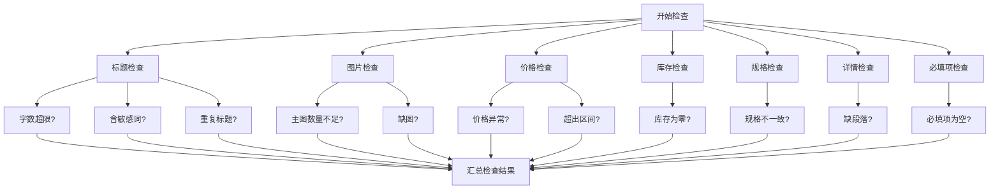

## 1. 产品概述

电商商品资料批量检查工具，帮助电商运营人员高效完成商品上架前的资料审核工作。工具支持多平台规则配置、自动化检查、问题定位和批量修正建议，显著提升商品上架效率和资料质量。

- **核心目标**：替代人工逐一审校商品资料的繁琐工作，通过自动化规则检查快速定位问题
- **目标用户**：电商运营人员、商品专员、平台管理员
- **市场价值**：减少人工审核失误、缩短商品上架周期、提升多平台资料一致性

## 2. 核心功能

### 2.1 用户角色

| 角色 | 登录方式 | 核心权限 |
|------|----------|----------|
| 运营人员 | 本地使用（无需登录） | 导入资料、配置规则、查看检查结果、导出任务 |

### 2.2 功能模块

1. **资料导入模块**：支持批量导入商品数据，包含标题、卖点、价格、图片清单、规格、库存、物流信息
2. **规则配置模块**：配置不同平台的检查规则，包括字数限制、禁用词、主图数量、价格区间、必填项
3. **检查结果模块**：展示检查结果列表，支持按严重程度、问题类型筛选，查看详情
4. **批量修正建议模块**：根据检查结果生成修正建议清单，支持逐项处理
5. **导出任务模块**：将待处理任务导出，分配给商品负责人跟进

### 2.3 页面详情

| 页面名称 | 模块名称 | 功能描述 |
|----------|----------|----------|
| 工作台 | 顶部导航 | 模块切换、当前平台选择、统计概览 |
| 工作台 | 数据概览卡片 | 商品总数、问题数、严重程度分布、检查完成率 |
| 资料导入 | 文件上传区 | 拖拽上传、文件选择、支持Excel/CSV/JSON格式 |
| 资料导入 | 数据预览表格 | 展示导入数据前N行，字段映射确认 |
| 资料导入 | 导入统计 | 导入成功数、失败数、跳过数 |
| 规则配置 | 平台选择器 | 切换不同平台的规则配置（淘宝、京东、拼多多、抖音等） |
| 规则配置 | 字数规则 | 标题字数、卖点字数、详情字数限制 |
| 规则配置 | 禁用词管理 | 敏感词列表增删改、支持批量导入 |
| 规则配置 | 图片规则 | 主图数量要求、图片命名规范 |
| 规则配置 | 价格规则 | 价格区间、最低价保护、最高价限制 |
| 规则配置 | 必填项规则 | 哪些字段为必填、不能为空 |
| 检查结果 | 筛选工具栏 | 严重程度筛选、问题类型筛选、搜索 |
| 检查结果 | 问题列表 | 商品列表，每行展示问题数量和严重程度标签 |
| 检查结果 | 问题详情面板 | 选中商品后展示具体问题清单和位置 |
| 批量修正建议 | 修正清单 | 按问题类型分组的修正建议列表 |
| 批量修正建议 | 处理状态 | 待处理、处理中、已完成状态管理 |
| 批量修正建议 | 负责人分配 | 为每条任务指定负责人 |
| 导出任务 | 导出选项 | 导出格式选择（Excel/CSV）、导出范围选择 |
| 导出任务 | 任务包生成 | 按负责人分组导出任务清单 |
| 导出任务 | 导出历史 | 历史导出记录查看 |

## 3. 核心流程

### 3.1 主流程描述

运营人员进入工具后，首先导入商品资料数据，然后选择或配置对应平台的检查规则，启动检查后查看检查结果，根据问题生成批量修正建议，最后导出任务清单分配给商品负责人处理。

### 3.2 流程图

### 3.3 问题检查流程

## 4. 用户界面设计

### 4.1 设计风格

- **主色调**：深海蓝 (#0F52BA) - 专业、可靠、信任感
- **辅助色**：警示红 (#E53E3E)、警告橙 (#ED8936)、成功绿 (#38A169)、信息蓝 (#3182CE)
- **背景色**：浅灰蓝 (#F7FAFC) 主背景，纯白 (#FFFFFF) 卡片背景
- **按钮风格**：圆角中等 (8px)，主按钮渐变填充，次要按钮边框式
- **字体**：中文使用 "PingFang SC" / "Microsoft YaHei"，数字和英文使用 "Roboto Mono"
- **布局风格**：左侧导航 + 右侧内容区，卡片式模块布局
- **图标风格**：线性图标，统一 24px 栅格，线条粗细 2px
- **整体调性**：专业高效的工具类产品，简洁清爽，信息密度适中

### 4.2 页面设计概览

| 页面名称 | 模块名称 | UI元素 |
|----------|----------|--------|
| 工作台 | 顶部状态栏 | 平台切换下拉、检查按钮、统计数字动效 |
| 工作台 | 数据概览 | 四张渐变卡片，数字大字展示，带图标和趋势 |
| 工作台 | 问题分布 | 环形图展示严重程度占比，问题类型柱状图 |
| 资料导入 | 上传区域 | 虚线边框上传框，拖拽态高亮，文件图标 |
| 资料导入 | 数据表格 | 斑马纹表格，固定表头，可横向滚动 |
| 规则配置 | 左侧平台列表 | 选中态高亮，平台图标 + 名称 |
| 规则配置 | 右侧规则表单 | 分组卡片，开关按钮，数字输入框，标签管理 |
| 检查结果 | 顶部筛选栏 | 标签式筛选，搜索框，导出按钮 |
| 检查结果 | 问题列表 | 每行商品，带严重程度标签徽章，展开详情 |
| 检查结果 | 详情侧栏 | 右侧滑出面板，问题列表带修正建议 |
| 批量修正 | 分组列表 | 按问题类型分组折叠面板，勾选操作 |
| 批量修正 | 分配弹窗 | 负责人选择，备注输入，批量分配 |
| 导出任务 | 导出设置 | 单选/多选格式，范围选择，预览按钮 |
| 导出任务 | 导出列表 | 历史导出记录，下载按钮，状态标签 |

### 4.3 响应式

- **设计优先**：桌面端优先设计 (1440px 基准)
- **平板适配**：≥1024px 保持两栏布局，适当缩小间距
- **手机适配**：≥768px 切换为单栏布局，导航改为底部Tab，表格支持横向滚动
- **触控优化**：移动端可点击区域 ≥44px，适当增加列表行高

### 4.4 动效与交互

- **页面切换**：淡入 + 轻微上移动画，200ms 缓动
- **卡片悬浮**：上移 2px + 阴影加深，150ms 过渡
- **按钮点击**：按压缩放效果 (scale 0.98)
- **状态标签**：新增时脉冲动画，提示用户注意
- **进度条**：检查进行时顶部进度条动画
- **侧栏滑出**：右侧滑入 + 遮罩淡入，250ms 缓动
