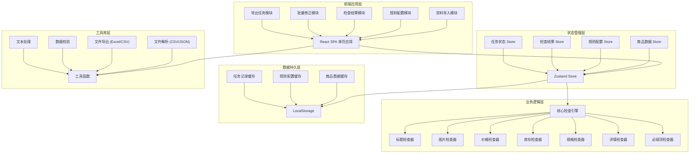
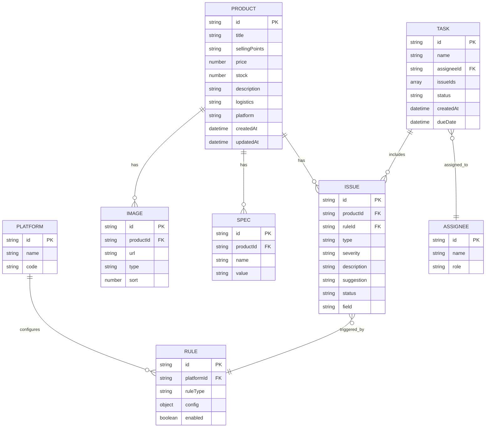
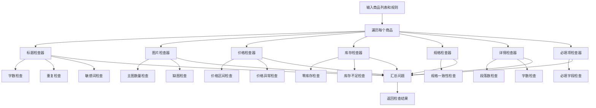

## 1. 架构设计



## 2. 技术描述

- **前端框架**：React@18 + TypeScript
- **构建工具**：Vite@5
- **样式方案**：TailwindCSS@3
- **状态管理**：Zustand
- **UI组件**：Headless UI + Heroicons
- **图表可视化**：Recharts
- **文件处理**：PapaParse (CSV解析)、xlsx (Excel导出)
- **日期处理**：date-fns
- **数据存储**：LocalStorage + IndexedDB (大量数据时)

## 3. 路由定义

| 路由 | 页面 | 说明 |
|------|------|------|
| /dashboard | 工作台 | 数据概览、快速操作入口 |
| /import | 资料导入 | 文件上传、数据预览、导入确认 |
| /rules | 规则配置 | 平台管理、各项规则参数配置 |
| /results | 检查结果 | 问题列表、筛选、详情查看 |
| /fixes | 批量修正 | 修正清单、状态管理、负责人分配 |
| /export | 导出任务 | 导出设置、任务包生成、导出历史 |

## 4. 数据模型

### 4.1 数据模型定义



### 4.2 类型定义

```typescript
// 商品数据
interface Product {
  id: string;
  title: string;
  sellingPoints: string[];
  price: number;
  originalPrice?: number;
  stock: number;
  images: ProductImage[];
  specs: ProductSpec[];
  description: string;
  logistics: LogisticsInfo;
  platform: string;
  category?: string;
  createdAt: string;
  updatedAt: string;
}

interface ProductImage {
  id: string;
  url: string;
  type: 'main' | 'detail' | 'sku';
  sort: number;
  name?: string;
}

interface ProductSpec {
  id: string;
  name: string;
  value: string;
  price?: number;
  stock?: number;
}

interface LogisticsInfo {
  weight?: number;
  size?: string;
  shippingMethod?: string;
  shippingFee?: number;
}

// 规则配置
interface PlatformRule {
  id: string;
  platform: string;
  platformName: string;
  enabled: boolean;
  titleRule: TitleRule;
  sellingPointRule: SellingPointRule;
  imageRule: ImageRule;
  priceRule: PriceRule;
  stockRule: StockRule;
  descriptionRule: DescriptionRule;
  requiredFields: string[];
  sensitiveWords: string[];
}

interface TitleRule {
  enabled: boolean;
  minLength: number;
  maxLength: number;
  checkDuplicate: boolean;
}

interface SellingPointRule {
  enabled: boolean;
  minCount: number;
  maxCount: number;
  maxLengthPerPoint: number;
}

interface ImageRule {
  enabled: boolean;
  minMainImages: number;
  maxMainImages: number;
  checkNaming: boolean;
  namingPattern?: string;
}

interface PriceRule {
  enabled: boolean;
  minPrice: number;
  maxPrice: number;
  checkAbnormal: boolean;
  abnormalThreshold?: number;
}

interface StockRule {
  enabled: boolean;
  minStock: number;
  checkZeroStock: boolean;
}

interface DescriptionRule {
  enabled: boolean;
  minParagraphs: number;
  minLength: number;
}

// 检查结果
interface CheckIssue {
  id: string;
  productId: string;
  productTitle: string;
  type: IssueType;
  severity: 'critical' | 'warning' | 'info';
  field: string;
  description: string;
  suggestion: string;
  status: 'pending' | 'processing' | 'resolved';
  assignee?: string;
  createdAt: string;
}

type IssueType =
  | 'title_too_short'
  | 'title_too_long'
  | 'title_duplicate'
  | 'title_sensitive_word'
  | 'selling_point_insufficient'
  | 'selling_point_too_many'
  | 'image_missing'
  | 'main_image_insufficient'
  | 'main_image_exceed'
  | 'price_too_low'
  | 'price_too_high'
  | 'price_abnormal'
  | 'stock_zero'
  | 'stock_insufficient'
  | 'spec_inconsistent'
  | 'description_too_short'
  | 'description_paragraph_insufficient'
  | 'required_field_missing'
  | 'sensitive_word_detected';

// 任务
interface ExportTask {
  id: string;
  name: string;
  format: 'xlsx' | 'csv';
  scope: 'all' | 'selected' | 'by_severity' | 'by_type';
  severityFilter?: string[];
  typeFilter?: string[];
  assignee?: string;
  issueCount: number;
  productCount: number;
  status: 'pending' | 'generating' | 'completed' | 'failed';
  downloadUrl?: string;
  createdAt: string;
  createdBy: string;
}

// 负责人
interface Assignee {
  id: string;
  name: string;
  role: string;
  avatar?: string;
  taskCount: number;
}
```

## 5. 检查引擎设计

### 5.1 检查器接口

```typescript
interface Checker {
  name: string;
  check(product: Product, rule: PlatformRule): CheckIssue[];
}
```

### 5.2 检查流程



## 6. 项目目录结构

```
src/
├── assets/           # 静态资源
│   ├── images/
│   └── icons/
├── components/       # 通用组件
│   ├── ui/           # 基础UI组件
│   │   ├── Button.tsx
│   │   ├── Input.tsx
│   │   ├── Card.tsx
│   │   ├── Modal.tsx
│   │   ├── Tabs.tsx
│   │   └── Table.tsx
│   ├── layout/       # 布局组件
│   │   ├── Sidebar.tsx
│   │   ├── Header.tsx
│   │   └── Layout.tsx
│   └── common/       # 业务通用组件
│       ├── StatCard.tsx
│       ├── SeverityBadge.tsx
│       └── PlatformSelector.tsx
├── pages/            # 页面组件
│   ├── Dashboard/
│   ├── Import/
│   ├── Rules/
│   ├── Results/
│   ├── Fixes/
│   └── Export/
├── store/            # 状态管理
│   ├── productStore.ts
│   ├── ruleStore.ts
│   ├── issueStore.ts
│   └── taskStore.ts
├── services/         # 业务服务
│   ├── checkEngine/  # 检查引擎
│   │   ├── index.ts
│   │   ├── titleChecker.ts
│   │   ├── imageChecker.ts
│   │   ├── priceChecker.ts
│   │   ├── stockChecker.ts
│   │   ├── specChecker.ts
│   │   ├── descriptionChecker.ts
│   │   └── requiredChecker.ts
│   ├── fileService.ts
│   └── exportService.ts
├── utils/            # 工具函数
│   ├── format.ts
│   ├── validate.ts
│   ├── storage.ts
│   └── id.ts
├── types/            # TypeScript类型
│   ├── product.ts
│   ├── rule.ts
│   ├── issue.ts
│   └── task.ts
├── data/             # Mock数据
│   ├── mockProducts.ts
│   ├── mockRules.ts
│   └── mockIssues.ts
├── hooks/            # 自定义Hooks
│   ├── useCheck.ts
│   ├── useFile.ts
│   └── useDebounce.ts
├── App.tsx
├── main.tsx
└── index.css
```
